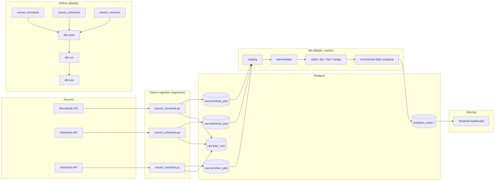
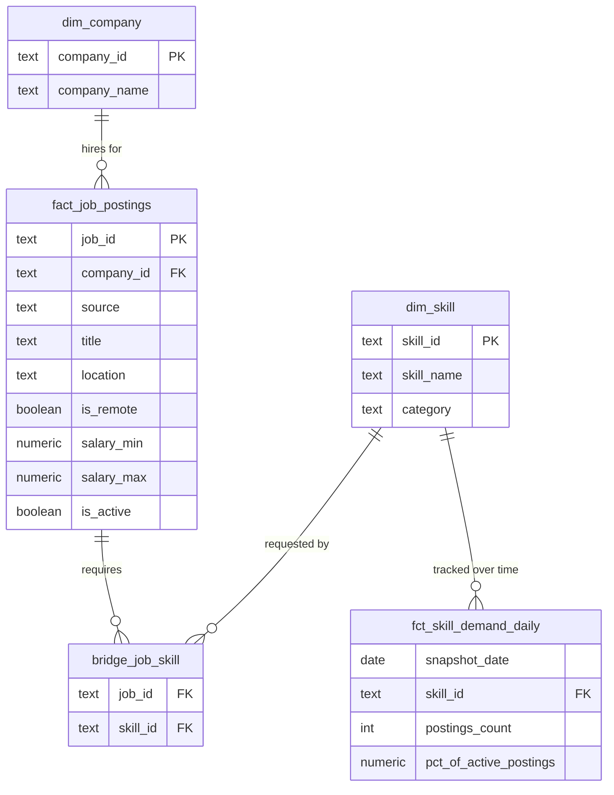

# SkillScope — Data & Software Job Market Pipeline

[](https://github.com/KyriakosCK/de-job-market-pipeline/actions/workflows/ci.yml)

An end-to-end **ELT pipeline** that pulls live tech job postings from public
APIs, lands them raw in Postgres, models them into an analytics star schema
with **dbt**, orchestrates the whole thing daily with **Apache Airflow**, and
serves the result through a **Streamlit** dashboard that answers one
question: *which skills are actually in demand right now?*

It's a portfolio project, but it's built the way I'd build it at work: typed
raw-vault-style landing tables, a documented and tested dbt layer, a real
Airflow DAG (not a notebook), unit tests, CI, and a Docker Compose stack that
brings the whole thing up with one command.

```
docker compose up --build
```

Then open Airflow at http://localhost:8080 (login: `admin` / `admin`),
trigger the `job_market_pipeline` DAG, and once it finishes, open the
dashboard at http://localhost:8501.

## Why this project

Every source of "what skills should I learn" advice is either a listicle or
a gut feeling. This pipeline answers it with data: it ingests real postings,
tags each one against a maintained skill taxonomy (Python, SQL, Airflow,
dbt, Spark, Kafka, Snowflake, cloud platforms, etc.), and tracks how demand
for each skill shifts day over day. It's also, deliberately, a project about
the *engineering* — reproducibility, testing, and observability — not just
the data.

## Architecture



See [`docs/architecture.md`](docs/architecture.md) for the data model in
detail (star schema diagram, table grains, and the design decisions behind
them).

## Tech stack

| Layer | Tool | Why |
|---|---|---|
| Ingestion | Python 3.11, `requests`, `psycopg2` | No framework needed for three REST APIs; keeps the extract layer simple, typed, and unit-testable |
| Storage | PostgreSQL 16 | Raw JSONB landing zone + analytics schema, one engine, zero extra infra |
| Transformation | dbt (dbt-postgres) | Version-controlled SQL, built-in testing/docs, incremental models |
| Orchestration | Apache Airflow 2.10 (LocalExecutor), or Windows Task Scheduler | Airflow DAG in the Docker stack; a plain scheduled `run_pipeline.bat` for a lightweight always-on local run |
| Serving | Streamlit + Plotly | Fast to build, good enough for a real analytics-facing dashboard |
| Packaging | Docker Compose | `docker compose up` reproduces the whole stack on any machine |
| Testing | pytest, dbt tests (schema + singular) | Ingestion logic and data quality are both covered, not just "it ran" |
| CI | GitHub Actions | Lints + unit tests + a full dbt build/test against an ephemeral Postgres + Airflow DAG import check, on every push |

## Repository layout

```
de-job-market-pipeline/
├── ingestion/              # Python extractors (pure functions + thin I/O layer)
│   ├── extract_remoteok.py
│   ├── extract_arbeitnow.py
│   ├── extract_remotive.py
│   ├── transform.py        # filtering, id-generation, text repair, unit tested
│   ├── repair_raw_encoding.py  # one-off backfill for already-landed rows
│   ├── db.py                # Postgres upsert helpers
│   └── config.py
├── sql/ddl_raw_tables.sql  # raw schema DDL (idempotent)
├── dbt/job_market/         # staging -> intermediate -> marts, seeds, tests
├── airflow/
│   ├── Dockerfile          # Airflow image + dbt installed
│   └── dags/job_market_pipeline_dag.py
├── dashboard/               # Streamlit app reading only from analytics_marts
├── tests/                   # pytest unit tests + API-shaped fixtures
├── .github/workflows/ci.yml
├── run_pipeline.bat         # daily run for Windows Task Scheduler (no Docker)
└── docker-compose.yml
```

## Data model

Three public job board APIs are combined onto one schema:

* **RemoteOK** (`remoteok.com/api`) — global remote postings across every
  industry; filtered down to data/software roles by keyword matching on
  title, tags, and description (`ingestion/transform.py::is_relevant`).
* **Arbeitnow** (`arbeitnow.com/api/job-board-api`) — EU-focused postings,
  paginated, filtered the same way.
* **Remotive** (`remotive.com/api/remote-jobs`) — remote-only postings,
  filtered by Remotive's own category label rather than keyword guessing
  (`ingestion/transform.py::filter_remotive_jobs`).

I also tried Adzuna and dropped it. Its search API truncates descriptions
at exactly 500 characters with no ellipsis, so skill tagging against that
text would silently undercount anything past the cutoff. Its salaries came
back as `salary_is_predicted` model output rather than posted figures, and
its results were UK on-site listings in a project that's specifically about
remote roles — not a fit on any of the three counts.



Full column-level docs and lineage are generated by dbt:

```bash
cd dbt/job_market
dbt docs generate && dbt docs serve
```

## Running it

### Option A — full stack with Docker Compose (recommended)

```bash
git clone https://github.com/KyriakosCK/de-job-market-pipeline.git
cd de-job-market-pipeline
cp .env.example .env
docker compose up --build
```

* Airflow UI: http://localhost:8080 (`admin` / `admin`) — trigger the
  `job_market_pipeline` DAG manually the first time, or wait for its daily
  `@daily` schedule.
* Dashboard: http://localhost:8501 — populates once the DAG's `dbt_run`
  task finishes.
* Warehouse Postgres is exposed on `localhost:5433` if you want to poke at
  it directly with `psql` or a BI tool.

### Option B — run pieces locally without Docker

```bash
python3 -m venv .venv && source .venv/bin/activate
pip install -r requirements.txt

# point at any Postgres you have (see .env.example for the vars)
export WAREHOUSE_HOST=localhost WAREHOUSE_PORT=5432 \
       WAREHOUSE_DB=warehouse WAREHOUSE_USER=jobmarket WAREHOUSE_PASSWORD=jobmarket

python -m ingestion.extract_remoteok
python -m ingestion.extract_arbeitnow

pip install dbt-postgres
cd dbt/job_market && dbt seed && dbt run && dbt test && cd ../..

streamlit run dashboard/app.py
```

### Option C — scheduled daily run on Windows (no Docker)

`run_pipeline.bat` runs the RemoteOK and Remotive extractors followed by
`dbt build`, writes a dated log to `logs/pipeline_YYYY-MM-DD.log`, and
exits non-zero if any step fails. Point a Windows Task Scheduler task at it
to refresh the warehouse daily.

## Testing

```bash
pytest -v --cov=ingestion              # ingestion unit tests, fixtures captured from real API responses
cd dbt/job_market && dbt build         # seeds + models + 62 schema/singular data-quality tests
ruff check ingestion tests dashboard   # lint
```

Every one of the above also runs in CI on every push — see
[`.github/workflows/ci.yml`](.github/workflows/ci.yml), which spins up an
ephemeral Postgres service container to run a full `dbt seed && dbt run &&
dbt test` against fixture data, and separately validates that the Airflow
DAG imports without errors.

## Design decisions worth asking me about

* **Raw JSONB landing zone, not typed columns on ingest.** The Python
  layer's only job is "land it faithfully." Schema drift on the source
  side (a renamed field, a new tag format) breaks a dbt model, which fails
  loudly with a clear error — it never silently breaks ingestion.
* **Independent extractors, one shared upsert path.** Adding a source
  means writing one new `extract_*.py`, one new `stg_*.sql` model and one
  `union all` branch. Remotive was added exactly this way.
* **Repairing a broken source at the edge, with a backstop.** RemoteOK's
  API double-encodes non-ASCII text: Dubai arrives as `دبÙ`, Macaé as
  `Macaé`. Checked against the raw response bytes, so it's the source,
  not our HTTP client. The fix has three layers:
  `transform.repair_mojibake` repairs text before it lands (unit tested on
  real corrupted values, idempotent, leaves genuine `é`/`ü` alone), a
  one-off backfill fixed the rows already landed, and dbt nulls anything
  still unrepairable (e.g. a `™` the source truncated mid-character) to
  "Unspecified". A warn-level dbt test reports how often that fallback
  fires, so a source changing its encoding shows up in test output.
  Once decoded, some locations turned out to be in Arabic, Korean or
  Japanese only; a `location_translations` seed maps them to English, and
  another warn-level test lists any new ones that need a row.
* **`is_active` instead of deleting stale rows.** Postings aren't hard
  deleted when a source stops listing them — `fact_job_postings.is_active`
  is derived from `last_seen_at`, so historical analysis (fct_skill_demand_daily)
  never loses rows out from under it.
* **Incremental daily snapshot, not a dbt snapshot.** dbt's built-in
  snapshot feature is meant for source-table SCD2, not derived marts; a
  plain incremental model with a `(snapshot_date, skill_id)` unique key
  gets the same "one partition per day" trend data with less magic.
* **Two Postgres instances (Airflow metadata vs. warehouse), not one.**
  Mirrors how a real environment keeps orchestration state and analytics
  data on separate databases, without the extra operational cost of a
  fully managed metastore for a project this size.

## What I'd change at real scale

Being upfront about the next iteration matters more than pretending this is
already infinitely scalable:

* Swap the two Postgres containers for a managed warehouse (Snowflake /
  BigQuery / Redshift) and an RDS-backed Airflow metastore.
* Move orchestration to `CeleryExecutor` or `KubernetesExecutor` once more
  than a handful of tasks need to run concurrently.
* Add a proper SCD2 dimension for `dim_company` if company attributes
  (size, industry) get added later, instead of the current type-1 dimension.
* Replace keyword-matching skill extraction with a small NER/classification
  model once the description text volume justifies it.

## Skills this project demonstrates

Python (ingestion, testing) · SQL (dbt models, window functions, JSONB) ·
dbt (staging/marts modeling, seeds, macros, incremental models, testing,
docs) · Apache Airflow (DAG design, task dependencies, retries) · PostgreSQL
(schema design, indexing, JSONB) · Docker & Docker Compose · CI/CD (GitHub
Actions) · data modeling (star schema, SCD-aware fact tables) · data quality
testing · Streamlit/Plotly for lightweight BI.

## License

MIT — see [LICENSE](LICENSE).
