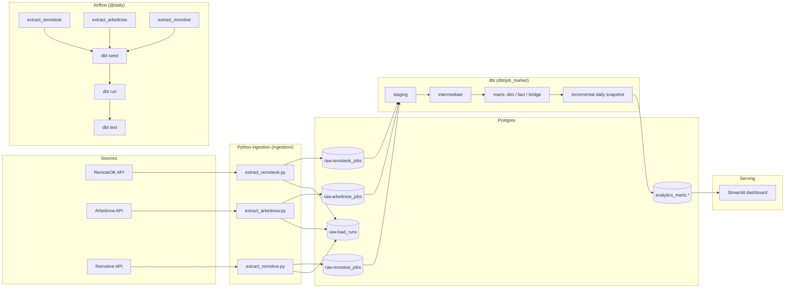
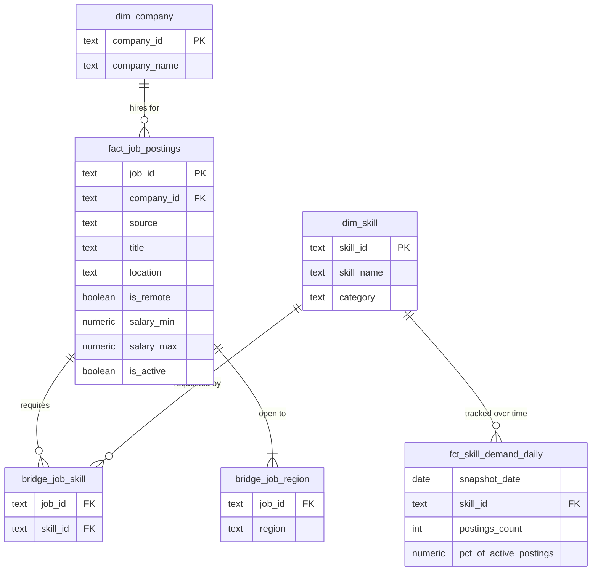

# SkillScope — Data & Software Job Market Pipeline

[](https://github.com/KyriakosCK/de-job-market-pipeline/actions/workflows/ci.yml)

An ELT pipeline that collects tech job postings from public job board APIs,
lands them as raw JSON in Postgres, models them into a star schema with
**dbt**, and serves a **Streamlit** dashboard showing which skills are in
demand and how that changes day to day. It runs daily, orchestrated by
**Airflow** in Docker Compose or by a scheduled script.

## Architecture



1. **Extract & load.** One Python extractor per source fetches postings,
   drops irrelevant ones, and upserts each payload as JSONB into its own
   `raw.*` table. Every run is logged to `raw.load_runs`.
2. **Transform.** dbt flattens each source in staging, unions them onto a
   common shape, tags skills against a seed taxonomy, and builds the marts.
3. **Serve.** The dashboard reads only from `analytics_marts`.

Table grains and the star schema are described in
[`docs/architecture.md`](docs/architecture.md).

## Tech stack

| Layer | Tool |
|---|---|
| Ingestion | Python 3.11, `requests`, `psycopg2` |
| Storage | PostgreSQL (raw JSONB landing zone + analytics schemas) |
| Transformation | dbt (dbt-postgres): staging, intermediate, marts, seeds, incremental model |
| Orchestration | Apache Airflow 2.10 (LocalExecutor), or `run_pipeline.bat` via Windows Task Scheduler |
| Serving | Streamlit + Plotly |
| Packaging | Docker Compose |
| Testing | pytest, dbt schema and singular tests |
| CI | GitHub Actions |

## Data sources

| Source | Coverage | Relevance filter |
|---|---|---|
| [RemoteOK](https://remoteok.com/api) | Remote postings, all industries | Keyword match at ingestion, then role keywords in the title (dbt) |
| [Arbeitnow](https://www.arbeitnow.com/api/job-board-api) | EU postings, paginated | Same as RemoteOK |
| [Remotive](https://remotive.com/api/remote-jobs) | Remote-only postings | The source's own job category |

Adzuna was evaluated and not used: its search API truncates descriptions
at 500 characters (which would undercount skills), its salaries are model
predictions rather than posted figures, and its results were mostly UK
on-site roles.

## Data model



Column-level docs and lineage are generated by dbt:

```bash
cd dbt/job_market
dbt docs generate && dbt docs serve
```

## Running it

### Docker Compose (full stack)

```bash
git clone https://github.com/KyriakosCK/de-job-market-pipeline.git
cd de-job-market-pipeline
cp .env.example .env
docker compose up --build
```

* Airflow: http://localhost:8080 (`admin` / `admin`). Trigger the
  `job_market_pipeline` DAG, or wait for the daily schedule.
* Dashboard: http://localhost:8501, populated after the first DAG run.
* Warehouse Postgres: `localhost:5433`.

### Local, without Docker

```bash
python -m venv .venv && source .venv/bin/activate
pip install -r requirements.txt dbt-postgres

# any Postgres works; see .env.example for the variables
export WAREHOUSE_HOST=localhost WAREHOUSE_PORT=5432 \
       WAREHOUSE_DB=warehouse WAREHOUSE_USER=jobmarket WAREHOUSE_PASSWORD=jobmarket

python -m ingestion.extract_remoteok
python -m ingestion.extract_remotive
(cd dbt/job_market && dbt build --profiles-dir .)

streamlit run dashboard/app.py
```

### Scheduled on Windows

`run_pipeline.bat` runs the RemoteOK and Remotive extractors and
`dbt build`, logs to `logs/pipeline_YYYY-MM-DD.log`, and exits non-zero if
any step fails. Point a Windows Task Scheduler task at it for a daily
refresh.

## Testing

```bash
pytest -v --cov=ingestion                        # unit tests, fixtures from real API responses
(cd dbt/job_market && dbt build --profiles-dir .) # models + 74 schema/singular tests
ruff check ingestion tests dashboard             # lint
```

CI runs all three on every push: lint and unit tests, a full `dbt build`
against a Postgres service container loaded with fixture data, and a check
that the Airflow DAG imports cleanly.

## Design notes

* **Raw JSONB landing.** Ingestion stores whole payloads rather than
  mapping them to typed columns (the one content change is the encoding
  repair below), so a change in a source's schema breaks a dbt model with
  a clear error instead of breaking ingestion.
* **One extractor per source, shared load path.** Adding a source takes an
  `extract_*.py`, a `stg_*.sql` model, and a `union all` branch in
  `int_jobs_unioned`.
* **Soft-expiring postings.** Postings are never deleted.
  `fact_job_postings.is_active` is derived from `last_seen_at` (14-day
  window, configurable in `dbt_project.yml`), so historical trend data
  stays intact.
* **Incremental model for the daily trend.** `fct_skill_demand_daily` is an
  incremental model keyed on `(snapshot_date, skill_id)`. dbt snapshots
  track row changes in source tables (SCD2), which isn't what a daily
  aggregate needs.
* **Handling a source encoding defect.** RemoteOK's API double-encodes
  non-ASCII text (`Macaé` arrives as `Macaé`). `transform.repair_mojibake`
  repairs it before loading, `repair_raw_encoding.py` backfilled existing
  rows, and dbt maps anything still unrepairable to NULL. Locations sent
  only in non-Latin scripts are translated through the
  `location_translations` seed. Two warn-level dbt tests report when either
  fallback is used.
* **Locations mapped to hiring regions.** A remote posting's location is
  often a list of regions it hires from ("LATAM, Europe, USA"), not an
  office. `bridge_job_region` maps each posting to every region whose
  keyword appears in its location (`region_keywords` seed), so a posting
  counts once in each region it's open to.
* **Separate Postgres instances** for Airflow metadata and the warehouse,
  so orchestration state and analytics data don't share a database.

## Limitations and next steps

* Skill tagging is keyword-based, so it can miss synonyms or match
  unrelated uses of a word. A classifier would be more accurate at higher
  volumes.
* The source APIs return only their most recent postings, so coverage
  depends on running daily.
* At larger scale: a managed warehouse (Snowflake, BigQuery), a
  Celery or Kubernetes executor for Airflow, and an SCD2 `dim_company` if
  company attributes are added.

## License

MIT — see [LICENSE](LICENSE).
